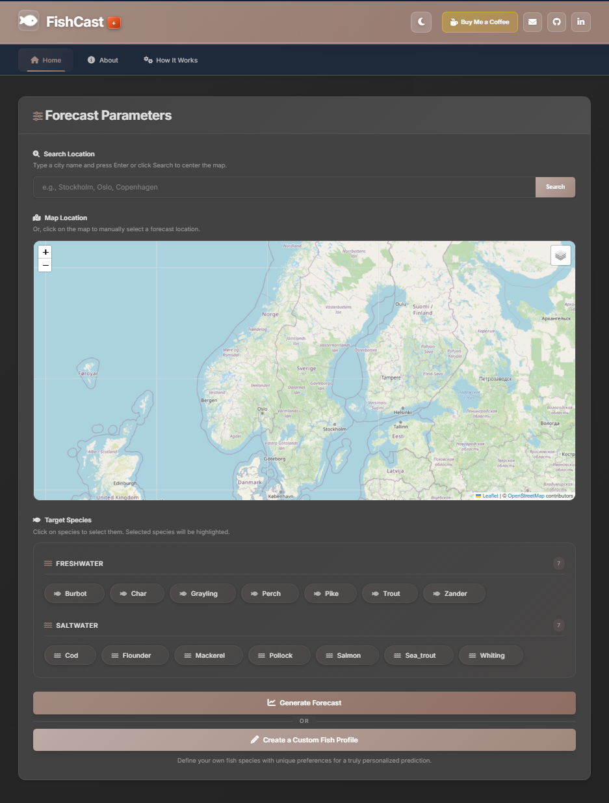

# 🎣 FishCast+

A sophisticated fishing forecast web application that provides dynamic "Bite Score" predictions by analyzing meteorological, oceanographic, and astronomical data to help anglers find the best fishing times.

---

# 🔗 Links

- **Website**: [https://fishcastplus.se](https://fishcastplus.se)
---

## ✨ Features

### 🎯 Core Functionality
- **Dynamic Bite Score**: Advanced algorithm calculates hourly fishing forecast (0-100%) based on multiple environmental factors
- **Interactive Map**: Select any fishing location by clicking on the map or searching for a city
- **Multi-Species Support**: Get forecasts for various predefined fish species with unique behavioral profiles
- **Custom Fish Profiles**: Create and save personalized fish profiles with custom preferences

### 📊 Detailed Forecasts
- **Hourly Breakdown**: Complete hourly forecast including:
  - Bite Score percentage
  - Water temperature
  - Wind speed and direction
  - Barometric pressure
  - Tide information
  - Moon phase and solunar data
- **Daily Summaries**: Overview of best fishing times for each day
- **Best Time Recommendations**: AI-powered suggestions for optimal fishing windows

### 🧠 Intelligent Algorithm
The Bite Score algorithm considers:
- **🌡️ Water Temperature**: Compares current temperature to fish's optimal feeding range
- **🌊 Tides & Currents**: Strong water movement bonuses for saltwater species
- **📉 Barometric Pressure**: Falling pressure provides major bonus, rising pressure penalty
- **🌔 Solunar Data**: Moon phase, moonrise, moonset, and overhead/underfoot positions
- **💨 Wind & Weather**: Wind speed, direction, cloud cover, and precipitation
- **📅 Seasonal Patterns**: Bonuses for specific seasons and times (dawn, dusk)

### 🛠️ Technical Features
- **Robust Backend**: Built with Java Spring Boot for reliability and scalability
- **Effective Caching**: Server-side caching for fast response times
- **Secure Endpoints**: Spring Security protection for sensitive data
- **Comprehensive Testing**: Automated unit and integration tests
- **RESTful API**: Clean, well-documented API endpoints
- **Monitoring & Analytics**: Real-time monitoring with Prometheus, Grafana dashboards, and Google Analytics integration

---

## 🖥️ Screenshots

> **Note:** Screenshots will be added here. Please add your application screenshots to showcase the interface.

### Interactive Map Interface

---

## 📋 Key Capabilities

### For Anglers
- ✅ Find the best fishing times with AI-powered predictions
- ✅ Get location-specific forecasts for any fishing spot
- ✅ Track multiple fish species with unique behavioral profiles
- ✅ Create custom fish profiles for personalized forecasts
- ✅ View detailed hourly breakdowns of conditions
- ✅ Access historical data and trends

### For Fishing Guides
- ✅ Plan trips based on optimal fishing conditions
- ✅ Provide clients with data-driven recommendations
- ✅ Track multiple locations simultaneously
- ✅ Access comprehensive environmental data

### For Researchers
- ✅ Analyze fishing patterns and environmental correlations
- ✅ Access detailed meteorological and oceanographic data
- ✅ Study fish behavior patterns
- ✅ Export data for further analysis

---

## 🛠️ Technology Stack

### Backend
- **Java 17**: Modern Java features and performance
- **Spring Boot 3.5.4**: Enterprise-grade framework
- **Spring Web & MVC**: RESTful API architecture
- **Spring Cache (Caffeine)**: High-performance caching
- **Spring Security**: Secure endpoint protection
- **Maven**: Dependency management

### Frontend
- **HTML5 & CSS3**: Modern web standards
- **JavaScript (ES6+)**: Interactive user interface
- **Leaflet.js**: Interactive map functionality
- **Chart.js**: Data visualization

### Monitoring & Analytics
- **Prometheus**: Metrics collection and time-series database
- **Grafana**: Real-time dashboards and visualization
- **Google Analytics**: User behavior tracking and insights

### Data Sources
- **SMHI**: Swedish Meteorological and Hydrological Institute (weather and oceanographic data)
- **OpenStreetMap Nominatim**: Geocoding and location services

---

## 📞 Contact & Support

For inquiries, support, or licensing information:
- **Email**: support@fishcastplus.se
- **Website**: [https://fishcastplus.se](https://fishcastplus.se)

---

## ⭐ Features at a Glance

| Feature | Description |
|---------|-------------|
| 🎯 Bite Score Algorithm | AI-powered 0-100% fishing forecast |
| 🗺️ Interactive Map | Click or search to select locations |
| 🐟 Multi-Species Support | Predefined profiles for various fish |
| ⚙️ Custom Profiles | Create personalized fish profiles |
| 📊 Hourly Forecasts | Detailed hourly condition breakdown |
| 🌡️ Environmental Data | Temperature, wind, pressure, tides |
| 🌔 Solunar Integration | Moon phase and position calculations |
| 📈 Best Time Recommendations | AI suggests optimal fishing windows |
| 🔒 Secure API | Protected endpoints with Spring Security |
| ⚡ High Performance | Caching and optimization for speed |
| 📊 Real-time Monitoring | Prometheus metrics and Grafana dashboards |
| 📈 Analytics | Google Analytics integration for user insights |

---

## 🧪 Testing

The application includes comprehensive automated testing:
- **Unit Tests**: Core business logic and algorithm testing
- **Integration Tests**: API endpoint validation
- **Mocking**: External API calls mocked for reliable testing
- **Coverage**: High test coverage ensures reliability

---

**© 2024 FishCast+. All rights reserved.**

